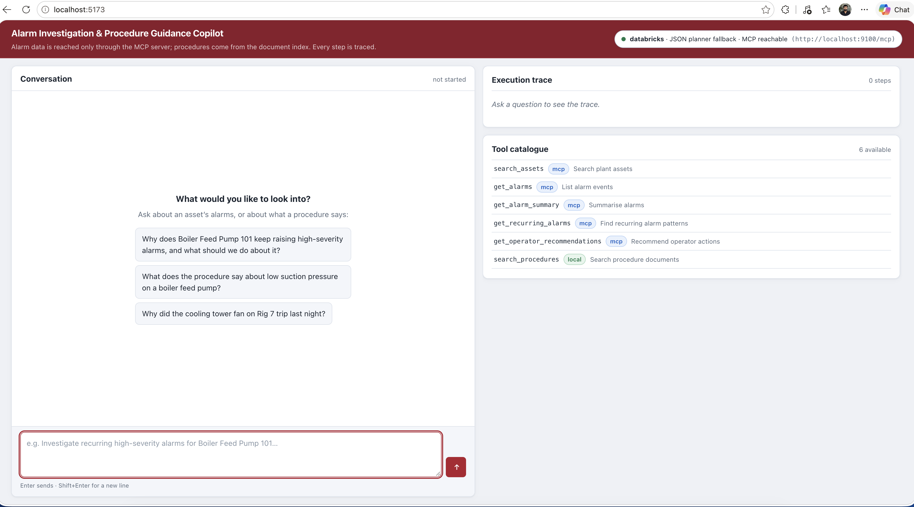
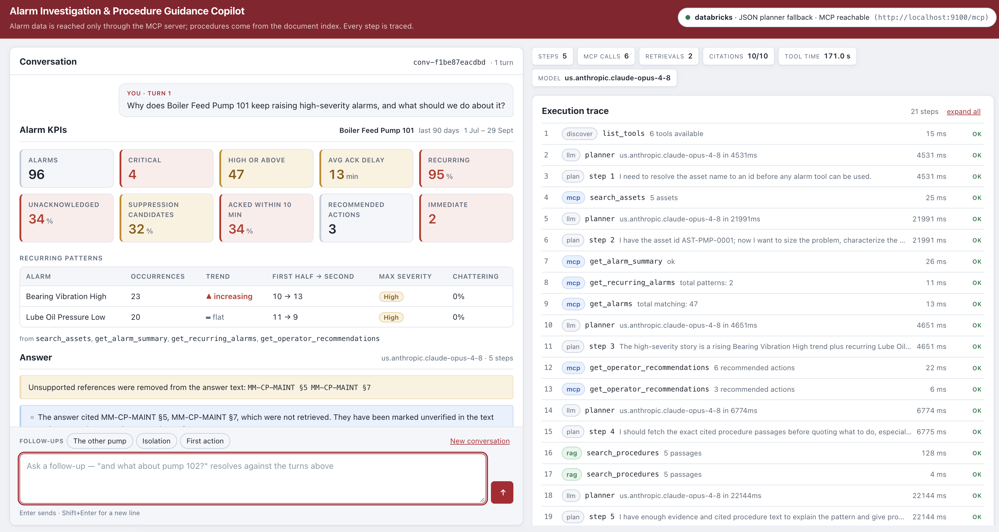
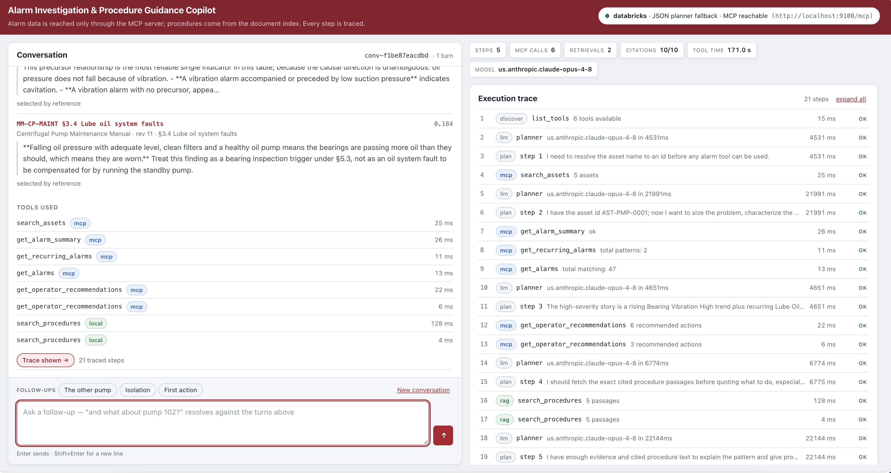

# Alarm Investigation & Procedure Guidance Copilot

A copilot that answers natural-language alarm questions by orchestrating an Alarm Management API
**exclusively through a purpose-built MCP server**, combined with document RAG over plant
procedures — in **one** business workflow. Every answer carries source citations and a full MCP
execution trace, both surfaced in the GUI.


---

## Selected use case

**Use Case #1 — Alarm Investigation & Procedure Guidance Copilot.**

The mandatory acceptance scenario, verbatim:

> Investigate recurring high-severity alarms for **Boiler Feed Pump 101** over the last 90 days,
> identify likely contributing factors, retrieve the relevant operating procedure, and provide
> recommended actions with source evidence.

That sentence is the system's test case, not a paraphrase of it: it lives in `tests/scenario.py` and
drives both the orchestration and end-to-end test layers.

## What it does

- **Resolves an asset by name.** "Boiler Feed Pump 101" → `AST-PMP-0001`, with metadata, over MCP.
- **Chains multiple API calls**, each using data the previous one returned — the asset id from the
  search feeds the recurrence query, and the recurrence result shapes the retrieval query.
- **Characterises a recurring pattern**: which alarm sequences repeat, at what severity, whether the
  frequency is rising.
- **Retrieves the governing procedure sections** from an indexed document corpus with hybrid
  search, and **pins by name** the exact sections the API's recommendations cited — so a cited
  section is fetched rather than hoped for, and a cited section missing from the corpus is reported
  instead of silently dropped.
- **Synthesises one grounded answer** that combines alarm data with document guidance, with a
  `[DOC §N]` citation on every documented claim. Markers that resolve to nothing retrieved are
  caught and reported, not published.
- **Abstains** when the corpus does not cover the question, rather than reasoning from weak matches.
- **Puts the figures above the prose.** A KPI header — volume, severity, acknowledgement delay,
  recurrence, and each repeating signature with its trend and its two halves — lifted from the tool
  results the answer was written from, never recomputed in the backend or the browser. A KPI no tool
  returned is rendered as absent, not as zero.
- **Streams a live execution trace**: every plan, MCP tool call, retrieval and LLM call, with raw
  request and response, status, duration, retry count and the propagated `trace_id`.
- **Degrades instead of failing.** A tool error goes back into the conversation as data; the
  investigation continues and the answer says what was unavailable.

## Technology stack

| Layer | Choice |
|---|---|
| Language / runtime | Python 3.13, managed with `uv` |
| Web framework | FastAPI + uvicorn, Pydantic v2 for every contract |
| MCP | Official `mcp` Python SDK (FastMCP), both `stdio` and `streamable-http` |
| HTTP connector | `httpx` + `tenacity` (retry, backoff, `Retry-After`) |
| Vector store | Qdrant, **embedded** (local path — no server to run) |
| Embeddings | `bge-small-en-v1.5` via `fastembed` (ONNX, ~50 MB, no torch) |
| Lexical search | `rank-bm25`, fused with dense results by reciprocal-rank fusion |
| LLM | Gemini via Google's Generative Language API — `:generateContent` over `httpx`, no SDK |
| GUI | React 18 + Vite + TypeScript, light theme, `react-markdown` for the answer (no raw HTML) |
| Tests | pytest, `respx`, `pytest-cov`, MCP in-memory client sessions |
| Quality | ruff (lint + format), mypy (strict), a secret scan in CI |

The LLM provider sits behind one interface (`apps/backend/llm/provider.py`) with two
implementations — Gemini and a scripted one for the tests — plus a JSON-planner path for models
without native tool calling. That seam was built for the "replaceable LLM provider" requirement
and then had to earn it: this project was originally written against Claude on a Databricks AI
gateway and was moved to Gemini wholesale. Only `apps/backend/llm/` changed; nothing in
`orchestration/` names a vendor or imports an HTTP client.

## Architecture summary

```
React GUI ──POST /chat (SSE)──▶ Copilot backend ──MCP──▶ Alarm MCP server ──HTTPS──▶ Alarm API
                                      │                  (holds ALARM_API_TOKEN)
                                      └──local tool──▶ RAG retriever ──▶ embedded Qdrant + BM25
```

| Layer | Directory | Role |
|---|---|---|
| Alarm API simulator | `apps/alarm_api/` | The source system, built to the Postman contract |
| API connector | `connectors/alarm_api/` | Typed HTTP client: auth, trace headers, retries, error mapping |
| **MCP server** | `mcp-servers/alarm_management/` | The only path to the Alarm API. Independently runnable |
| RAG | `rag/` | Ingestion, hybrid retrieval, citations, injection defence |
| Copilot backend | `apps/backend/` | LLM provider, tool registry, planner, orchestrator, trace, SSE API |
| GUI | `apps/frontend/` | Single-viewport console: multi-turn chat thread, KPI header, answer, evidence, per-turn MCP trace |

Three properties worth stating:

- **The copilot never speaks HTTP to the alarm API.** This is enforced structurally, not by
  convention: `apps/backend/config.py` has no `ALARM_API_*` field, so the backend cannot express the
  alternative. The token lives one process away.
- **RAG is a tool in the same catalogue as the MCP tools.** The planner sees one list and chooses
  among them in a single loop, so MCP and retrieval necessarily participate in one workflow rather
  than being two demos with a join at the end.
- **The browser holds no credential.** Everything secret is server-side.

Full component descriptions, the three trust boundaries and the complete eight-step request flow:
[`docs/architecture.md`](docs/architecture.md).

## The MCP server

`mcp-servers/alarm_management/` is a standalone MCP server with no dependency on the copilot
backend. It owns the alarm API credential, the retry policy, the row caps and the error mapping;
the copilot only knows how to call tools.

| Concern | Behaviour |
|---|---|
| Transports | `streamable-http` on `:9100/mcp` (default) and `stdio`, one codebase |
| Auth | `ALARM_API_TOKEN` read from the environment. **No tool argument can override it** |
| Correlation | `trace_id`, `x-client-id`, `x-metadata-tag` on every upstream request, echoed back in the tool result |
| Timeouts | `ALARM_API_TIMEOUT_SECONDS=10` per attempt |
| Retries | `ALARM_API_MAX_RETRIES=3`, exponential backoff capped at 4 s, honours `Retry-After` |
| Errors | Typed domain exceptions → MCP errors with a code, a remediation hint, and whether to retry |
| Row caps | `MCP_MAX_ROWS=100`, below the API's own cap — these payloads go into a context window |
| Secrets | Appear in no tool result, trace event or log line. Asserted end to end |

### MCP tools

| Tool | Purpose | Source-system operation |
|---|---|---|
| `search_assets` | Resolve an asset name or fragment to an id, with metadata | `GET /assets/search` + `GET /assets/{id}/metadata` |
| `get_alarms` | List alarms with filters and pagination | `GET /alarms` |
| `get_alarm_summary` | Aggregate counts by severity, type and asset over a window | `POST /alarms/summary` |
| `get_recurring_alarms` | Recurring sequences, frequency and whether it is increasing | `POST /alarms/recurring` |
| `get_operator_recommendations` | Ranked operator actions **plus the procedure sections they cite** | `POST /recommendations/operator-actions` |
| `search_procedures` | Hybrid document retrieval with citations (local tool, not MCP) | — |

`get_operator_recommendations` is the advanced operation, and its `procedure_references` field is
the seam between MCP and RAG: those exact strings are passed to `search_procedures(references=[…])`.

Per-tool input schemas, output schemas, auth behaviour, error behaviour, timeout behaviour and real
example invocations and responses: [`docs/mcp-tool-catalog.md`](docs/mcp-tool-catalog.md).

### Running the MCP server independently

```bash
# streamable HTTP (default) — a real service, curl-able and Inspector-able
make mcp                                    # :9100/mcp
make mcp MCP_PORT=9200                      # if 9100 is taken too (then set MCP_SERVER_URL to match)
uv run python -m alarm_management --transport streamable-http --port 9100

# stdio — for MCP Inspector or Claude Desktop
uv run python -m alarm_management --transport stdio

# discover the tools and chain three real calls over the wire
make mcp-smoke                              # needs `make api` running too

# point MCP Inspector at http://localhost:9100/mcp
npx @modelcontextprotocol/inspector
```

The server needs only `ALARM_API_BASE_URL` and `ALARM_API_TOKEN`. It does not need the copilot
backend, the LLM credential, or the RAG index.

## RAG corpus and ingestion

Four authored documents in `rag/documents/`, written so the acceptance scenario has real substance —
they explain the alarm pattern planted in the simulator's data:

| Document | Type | Role |
|---|---|---|
| `OP-BFP-101-operating-procedure.md` | `operating_procedure` | The procedure the scenario must retrieve |
| `TS-BFP-vibration-cavitation.md` | `troubleshooting_guide` | Low suction pressure → cavitation → vibration → bearing wear |
| `MM-centrifugal-pump-maintenance.md` | `maintenance_manual` | Lubrication intervals, seal replacement, alignment |
| `SAF-pump-isolation-loto.md` | `safety_procedure` | Lockout/tagout before any intervention |

**Ingestion** (`make ingest`) is: load Markdown + YAML frontmatter → sanitise injection patterns →
chunk → embed → replace the Qdrant collection. It produces **74 chunks**.

- **One chunk = one numbered section** (`## §4.2 Low suction pressure response`), because the
  section is the unit of citation. Sections are never merged; tables and numbered step lists are
  never split. `RAG_CHUNK_SIZE=380` is a soft budget and `make ingest` reports which chunks exceed
  it and why.
- **Retrieval is hybrid**: dense cosine over `bge-small-en-v1.5` plus BM25, fused with reciprocal
  rank fusion at `k=2` (not 60 — 60 is tuned for 1000-deep candidate lists; at depth 20 it
  degenerates into counting retrievers).
- **Citations** carry document id, title, revision, section number and title, a bounded quote, the
  relevance score and `selected_by`. A section pinned by name carries `score: null`, because nothing
  measured a relevance for it.
- **Abstention** is decided on the best dense cosine against `RAG_MIN_RELEVANCE=0.60` — a measured
  midpoint between on-topic (0.663–0.820) and off-topic (0.406–0.535) scores on this corpus, not a
  chosen number. RRF cannot serve here: it encodes only rank.
- **Prompt injection** is defended in three layers: sanitise at ingestion, wrap every passage as
  untrusted `trusted: false` data at prompt assembly, and validate every tool call against its
  schema so retrieved text cannot invent a tool or an argument.

All fourteen design points, with example retrieved chunks and the measured numbers:
[`docs/rag-design.md`](docs/rag-design.md).

## Quick start

Requires Python ≥3.12, Node ≥20 and [`uv`](https://docs.astral.sh/uv/).

```bash
git clone <repo-url> && cd senior-copilot-mcp-rag-assignment

cp .env.example .env        # then edit: set GEMINI_API_KEY (free, aistudio.google.com/apikey)
make install                # Python deps + frontend deps
make ingest                 # build the RAG index (first run downloads ~50 MB of ONNX weights)
```

If HuggingFace is unreachable or TLS is intercepted on your network, the weights cannot be
downloaded in-process:

```bash
make fetch-model            # fetches them out of band, prints a path
# then set RAG_EMBED_MODEL_PATH=<that path> in .env
```

Then bring the stack up — **one terminal**:

```bash
make dev
```

That starts all four services, waits for health, prints the URLs, tails every log, and stops the lot
on Ctrl-C. It also checks the ports first: if one is busy it names the PID and command holding it and
starts nothing, because the usual cause is an earlier run of this same stack and the alternative is a
half-started system whose copilot cannot reach its MCP server.

Or run them separately, one per terminal, which is what you want while working on one of them:

```bash
make api        # Alarm API simulator   :8000
make mcp        # MCP server            :9100
make backend    # copilot backend       :8080
make frontend   # GUI                   :5173
```

Open <http://localhost:5173>. The chat opens on three example questions — the first is the acceptance
scenario, and clicking it asks it. The GUI shows a health badge for each backend service and the live
tool catalogue, so a missing process is visible before you ask anything.

**If a service will not start**, it is almost always a port. `[Errno 48] Address already in use`
means something already holds it — find out what, and either stop it or move ours:

```bash
lsof -nP -iTCP -sTCP:LISTEN | grep -E ':(8000|9100|8080|5173) '

# ours, from an earlier run:
pkill -f 'uvicorn apps.alarm_api.main:create_app'
pkill -f 'alarm_management --transport'
pkill -f 'uvicorn apps.backend.api.main:app'

# or something else's, so move ours (and point the backend's MCP_SERVER_URL at the new one):
make dev MCP_PORT=9200 BACKEND_PORT=8081
```

Port 9000 is deliberately **not** used for MCP even though the assignment's compose file names it: on
a corporate macOS image it is commonly held by a local proxy — Microsoft OneDrive/Teams binds
`127.0.0.1:9000` on the machine this was built on — and the resulting failure is opaque.

### Docker

`docker-compose.yml` brings up all four services with health checks and dependency ordering:

```bash
cp .env.example .env
docker compose up --build
```

**This path is unverified** — `docker` is not installed on the machine this was built on. Treat it as
a packaging proposal; the `make` targets above are the tested path. See
[`docs/known-limitations.md`](docs/known-limitations.md).

## Build and run commands

| Command | What it does |
|---|---|
| `make install` | `uv sync --extra dev` + `npm install` |
| `make ingest` | Build the RAG index from `rag/documents` into embedded Qdrant |
| `make fetch-model` | Download the embedding weights out of band |
| `make dev` | **All four services in one terminal**, with a port preflight; Ctrl-C stops everything |
| `make api` | Alarm API simulator (`API_PORT`, default 8000) |
| `make mcp` | MCP server over streamable HTTP (`MCP_PORT`, default 9100) |
| `make backend` | Copilot backend (`BACKEND_PORT`, default 8080) |
| `make frontend` | Vite dev server (5173) |
| `make test-frontend` | GUI component tests (vitest + jsdom) |
| `make lint` / `make fmt` / `make typecheck` | ruff check / ruff format + fix / mypy |
| `make check` | Lint + types + tests — what CI runs |
| `make probe` | Ask the Gemini API whether it accepts this catalogue's translated tool schemas |
| `make mcp-smoke` | Discover and chain the MCP tools over real HTTP |
| `make smoke` | The acceptance scenario against the **real** LLM gateway |
| `make clean` | Remove indexes, caches and coverage output |
| `npm run build` (in `apps/frontend`) | Production frontend build (tsc + vite) |

`make help` lists them all.

## Tests

```bash
make test               # full suite with coverage
make test-unit
make test-integration
make test-e2e           # the acceptance scenario, end to end
make test-frontend      # GUI component tests (vitest + jsdom)
```

**809 Python tests, 95% line coverage**, no network and no API token required. The GUI has its own
**16 component tests** — `npm test` in `apps/frontend`, jsdom against the real component tree with
only `./api` substituted, so the conversation state machine is exercised rather than described.

The end-to-end test runs the **real** simulator, the **real** MCP server over a **real** MCP client
session, the **real** index and the **real** HTTP surface the GUI uses — with a deterministic
scripted LLM provider in place of the model. The nondeterminism is removed from exactly the one place
it was, and nowhere else. The scripted turns read asset ids and procedure references *out of the
conversation*, so a plan that ignored a tool result would fail rather than pass.

What that deliberately does not cover is whether a real model picks the right tools. `make smoke`
runs the same question against the live gateway, and the demo video shows it.

Two suites need something extra:

```bash
make fetch-model && uv run pytest rag/tests/test_retrieval_semantic.py -v   # needs the weights
uv run pytest -m live                                                       # needs GEMINI_API_KEY
```

`test_retrieval_semantic.py` holds every semantic-quality and calibration claim and **skips** without
the weights. A skipped test proves nothing — this is called out in the limitations.

## Sample interactions

### The acceptance scenario

> **Q:** Investigate recurring high-severity alarms for Boiler Feed Pump 101 over the last 90 days,
> identify likely contributing factors, retrieve the relevant operating procedure, and provide
> recommended actions with source evidence.

The trace that produces the answer:

```
plan                                                                        [llm]
search_assets("Boiler Feed Pump 101")              → AST-PMP-0001            [mcp]
get_recurring_alarms(asset_id, min_severity=high,
                     lookback_days=90)             → 2 patterns, 1 increasing [mcp]
get_operator_recommendations(asset_id)             → 3 ranked actions +
                                                     procedure_references     [mcp]
search_procedures(query, references=[…])           → passages + citations   [local]
finish                                                                      [llm]
answer                                                                      [llm]
```

The answer names the recurring sequence, attributes it to cavitation from low suction pressure, and
gives the documented response — each documented claim ending in a marker like
`[OP-BFP-101 §4.2]`, which the GUI renders as a citation card showing document, revision, section,
quote and relevance.

### A question the corpus does not cover

> **Q:** What is the recommended lubricant for a steam turbine governor?

The retriever's best dense score falls below 0.60, so `low_confidence` comes back `true` and the
answer says the corpus does not appear to cover the question — while the GUI still shows the nearest
candidates and their scores, so a reader can judge for themselves. It does not improvise from the
pump manual.

### A degraded run

Stop the MCP server and re-ask the acceptance question. Session setup fails with a
`ConnectionError`, the trace records it as a caught degradation with `MCP_UNREACHABLE`, the
investigation continues with the tools that remain, and the answer is written from documentation
alone with the gap stated in its caveats. No 500, no silent "no alarms found".

## Configuration

Every setting is environment-driven. [`.env.example`](.env.example) is the full list, each entry
commented with why the default is what it is — copy it to `.env` and fill in real values.

`.env` is gitignored. **No secret is ever committed, logged, or returned in an MCP response**, and
`scripts/check_secrets.sh` runs in CI.

The settings that matter most:

| Variable | Default | Notes |
|---|---|---|
| `GEMINI_API_KEY` | — | **Required** for the live paths. Free from [AI Studio](https://aistudio.google.com/apikey). Never commit it |
| `LLM_BASE_URL` | `https://generativelanguage.googleapis.com/v1beta` | |
| `LLM_MODEL` | `gemini-flash-latest` | |
| `LLM_NATIVE_TOOLS` | `true` | Confirm with `make probe`; `false` uses the JSON planner |
| `LLM_MAX_RETRIES` | `2` | The free tier answers `503 high demand` under load |
| `GEMINI_THINKING_BUDGET` | — | Leave blank for Gemini's default. Set to `0` if an answer comes back empty with `finishReason: MAX_TOKENS` |
| `ALARM_API_TOKEN` | `demo-token` | Held by the MCP server only |
| `MCP_SERVER_PORT` / `MCP_SERVER_URL` | 9100 | Not the assignment's 9000 — see limitations. Move both together, plus `--port` |
| `RAG_EMBEDDER` | `fastembed` | `hash` for a fully offline stand-in (lexical only) |
| `RAG_EMBED_MODEL_PATH` | empty | Set where HuggingFace is unreachable |
| `RAG_MIN_RELEVANCE` | `0.60` | Abstention threshold — measured, see `rag-design.md` |
| `ORCHESTRATOR_MAX_STEPS` | `8` | Bounds one question's cost against a metered gateway |
| `CONVERSATION_TURNS` | `4` | Earlier turns shown to the model on a follow-up; `1` makes every question independent |

There are four settings classes — alarm API, MCP, backend and RAG — each reading the same `.env`.
The separation is what makes "the simulator and the MCP server cannot leak the LLM credential"
structural rather than a promise.

## Assumptions

- **The Alarm Management API is simulated.** It is not reachable from the build machine.
  `apps/alarm_api` implements the contract in the supplied Postman collections, which
  `tests/integration/test_postman_contract.py` replays. Pointing at a real deployment is
  `ALARM_API_BASE_URL` + `ALARM_API_TOKEN` and nothing else.
- **Only four response shapes are pinned by the collection's tests.** Those are matched exactly; the
  rest were ours to design and are documented in the tool catalogue.
- **`POST /alarms/recurring` is an addition of ours**, not part of the given contract — the
  scenario's word *recurring* has no endpoint behind it otherwise.
- **Seed data is generated relative to `datetime.now(UTC)`** from a fixed RNG seed. The collection's
  static 2026-05-01 window would leave "the last 90 days" empty while every test still passed.
- **Boiler Feed Pump 101 carries a deliberately planted pattern** — suction pressure low →
  vibration high → bearing temperature high, recurring with rising frequency — so the scenario
  yields a real story rather than noise, and so the corpus has something to explain.
- **The document corpus is authored for this submission.** Four documents with realistic
  frontmatter, revisions and section numbering; no proprietary content.
- **Use Case #1 has no write operation**, so no approval flow is implemented. The requirement that
  writes need explicit confirmation is respected by there being nothing to confirm: every endpoint
  behind every tool is a read.
- **The copilot backend has no authentication**, and `GET /trace/{id}` is unauthenticated. This is a
  local demo; redaction therefore happens when a trace event is *recorded*, not when it is served.
- **Single-node, in-memory state.** The trace store holds `TRACE_RETENTION=50` conversations and
  clears on restart; BM25 is an in-memory index rebuilt at startup.

## Known limitations

The short list — the full version, with measured numbers, is
[`docs/known-limitations.md`](docs/known-limitations.md):

- **No cross-encoder reranker.** The highest-value single addition. RRF knows only rank agreement,
  and two measured artefacts of that are documented with numbers.
- **Similarity cannot tell "related" from "applicable."** A gas-turbine question scores 0.688
  against the pump maintenance manual — above the 0.60 threshold. Asserted as a characterisation
  test so nobody "fixes" it by raising the number.
- **Docker is written but unverified** — `docker` is not installed on the build machine.
- **Seven of fifteen API endpoints are not implemented**, a deliberate cut. `/alarms/correlation` is
  the one whose absence costs something real.
- **Semantic-quality tests skip without the embedding weights**, which need an out-of-band fetch
  behind a TLS-intercepting proxy.
- **Index refresh is a non-atomic full rebuild** — no content hashing, no versioned alias.
- **Pinned references crowd out search results** at `RAG_TOP_K=5`.
- **Conversation memory is in-process and four turns deep** — cleared on restart, and a follow-up
  deliberately re-runs its own tools rather than inheriting the earlier answer's evidence.
- **No rate limiting and no auth on the copilot.**
- **The real model's tool selection is not covered by a test** — by design; `make smoke` covers it.

## Documentation

| Document | Contents |
|---|---|
| [`docs/solution-overview.md`](docs/solution-overview.md) | **Start here** — the problem statement, the requirements traced to code and tests, assumptions, and what was not achieved |
| [`docs/architecture.md`](docs/architecture.md) | Components, ports, trust boundaries, the complete request flow, the diagram |
| [`docs/mcp-tool-catalog.md`](docs/mcp-tool-catalog.md) | Every tool: schemas, auth, errors, timeouts, real examples |
| [`docs/rag-design.md`](docs/rag-design.md) | Corpus, ingestion, chunking, embeddings, hybrid search, citations, confidence, injection defence |
| [`docs/api-integration.md`](docs/api-integration.md) | Endpoint coverage, auth, retries, pagination, trace headers, error envelope |
| [`docs/design-decisions.md`](docs/design-decisions.md) | Eighteen decisions, each with what was rejected and why |
| [`docs/known-limitations.md`](docs/known-limitations.md) | What is incomplete or unproven, and what I would do next |

The architecture diagram is generated, not drawn: `uv run python scripts/render_architecture_diagram.py`.

[`docs/pull-request.md`](docs/pull-request.md) is the pull-request description for the
documentation-and-packaging branch, kept in the repo so it is reviewable and so the body is not
retyped from memory.

## Demo video

▶️ **[`docs/media/demo-recording.mp4`](docs/media/demo-recording.mp4)** — credentials redacted. GitHub
plays it inline on the file page; 54 MB, so clone or download it for smoother local playback. Script:
[`docs/demo-script.md`](docs/demo-script.md). It covers tool discovery, an MCP execution trace with
raw request and response, RAG citations, one successful scenario and one degraded scenario.

## Screenshots

**Tool discovery, before any question.** Six tools resolved at startup — five reached over MCP
(`search_assets`, `get_alarms`, `get_alarm_summary`, `get_recurring_alarms`,
`get_operator_recommendations`) and `search_procedures` served locally by the document index. The
header carries the live provider, planner mode and MCP reachability.



**The acceptance scenario, answered.** For _"Why does Boiler Feed Pump 101 keep raising high-severity
alarms, and what should we do about it?"_ the copilot reports 96 alarms over 90 days (47 high-or-above,
95% recurring, 34% unacknowledged) and separates the two recurring patterns by trend — Bearing
Vibration High rising 10 → 13 across the window, Lube Oil Pressure Low flat. The banner above the
answer is the citation guard firing: two references the model produced, `MM-CP-MAINT §5` and `§7`,
were never retrieved, so they were stripped rather than passed off as sourced.



**Citations and per-call timings.** Each quoted passage carries its document, revision and retrieval
score, and every tool call is listed with its own latency across the 21 traced steps — so a reviewer
can tell which claim came from which passage and which call cost the time.



## How AI tools were used

This submission was built with Claude Code (Claude Opus 5) as a pair-programming tool, used for
scaffolding, test authoring, documentation drafting and review passes. Every design decision in
[`docs/design-decisions.md`](docs/design-decisions.md) was made and reviewed by me, and every claim
in the documentation is grounded in output I ran — the retrieval numbers are measured against the
real embedding model, the example responses are trimmed real responses, and the two bugs the
documentation pass surfaced (the `doc_types` enum mismatch and the SSE framing bug) were found by
reading the code against the docs rather than by accepting either.

## License

MIT — see [`LICENSE`](LICENSE).
