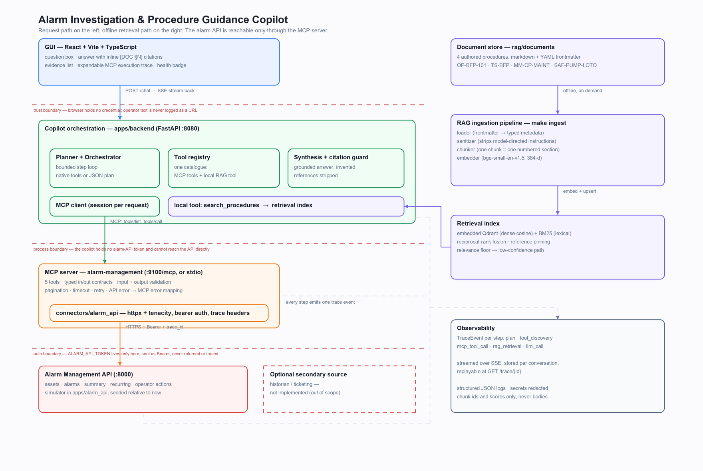

# Architecture



The diagram is generated from `scripts/render_architecture_diagram.py`, so it is regenerated
rather than redrawn when the code moves:

```bash
uv run python scripts/render_architecture_diagram.py
```

---

## The shape of it in one paragraph

A browser posts a question to the copilot backend. The backend holds one tool catalogue whose
entries come from two places: the MCP server, discovered over the wire at request time, and one
local retrieval tool. A bounded loop asks the model which tool to call next, executes the call,
feeds the result back, and repeats until the model concludes or the ceiling is reached. Each step
emits one trace event, streamed to the browser as it happens. The final answer is synthesised only
from what was gathered, and every citation in it is checked against the passages actually
retrieved before it is allowed out. The alarm API is reachable only through the MCP server, which
is the only process holding its credential.

## Processes

| Process | Port | Command | Holds a secret? |
|---|---|---|---|
| Alarm Management API simulator | 8000 | `make api` | no (accepts a bearer token) |
| MCP server `alarm-management` | 9100 | `make mcp` | yes — `ALARM_API_TOKEN` |
| Copilot backend | 8080 | `make backend` | yes — `GEMINI_API_KEY` |
| Vite dev server (GUI) | 5173 | `make frontend` | no |

The simulator stands in for the real Alarm Management API. It exists because the assignment's
API is not reachable from this machine, and because a seeded, deterministic source system is what
makes the acceptance scenario assertable. Everything above it — connector, MCP server, copilot —
is written against the documented contract, not against the simulator's internals, so pointing
`ALARM_API_BASE_URL` at a real deployment is a configuration change.

## Layers, and why each boundary is where it is

**`apps/alarm_api` — the source system.** FastAPI, bearer-authenticated, seeded relative to
`datetime.now(UTC)` so "the last 90 days" always contains data. Boiler Feed Pump 101 carries a
deliberately planted recurring high-severity pattern, because an acceptance scenario that returns
an empty window "passes" while demonstrating nothing.

**`connectors/alarm_api` — a typed HTTP client, used by nothing but the MCP server.** httpx plus
tenacity: bearer auth, the three correlation headers, per-attempt timeouts, retries on 429/5xx
only, and HTTP status mapped to domain exceptions. It is a separate package from the MCP server
because retry and error semantics are worth testing against `respx` without an MCP session in the
way, and because a second MCP server (or a batch job) would reuse it unchanged.

**`mcp-servers/alarm_management` — the MCP server.** Five tools, typed both ways, with domain
exceptions mapped to MCP errors written for the model that has to decide what to do next. Runs
over stdio or streamable HTTP from one codebase, selected by `--transport`. Independently
runnable and independently smoke-tested (`make mcp` + `make mcp-smoke`). See
[`mcp-tool-catalog.md`](mcp-tool-catalog.md).

**`rag/` — ingestion and retrieval.** Four authored procedure documents → sanitiser →
section-aligned chunker → embeddings → embedded Qdrant, searched dense + BM25 with
reciprocal-rank fusion and reference pinning. See [`rag-design.md`](rag-design.md).

**`apps/backend` — orchestration.** The `LLMProvider` abstraction, the unified `ToolRegistry`,
the planner, the bounded loop, synthesis with citation enforcement, the trace store, and the HTTP
surface. It has no `ALARM_API_*` setting at all: the rule "the alarm API is reached only through
MCP" is enforced by the backend being unable to express the alternative.

**`apps/frontend` — the GUI.** React + Vite + TypeScript, one hand-written light stylesheet.
Question box, a KPI header carrying the figures the alarm tools returned, the answer with inline
citation markers, the evidence list, an expandable MCP execution trace with raw request and
response, and a health badge showing which provider is in use and whether MCP is reachable.

The KPI header is a *projection*: `orchestration/kpis.py` lifts the numbers out of the same tool
results the answer was written from, and the component formats them without computing anything, so
a tile and the paragraph under it cannot disagree. A KPI no tool returned is absent rather than
zero — a documentation-only question and a degraded run both render no board at all, because in an
alarm application a zero reads as "checked, and clear".

### The three boundaries drawn on the diagram

1. **Browser ↔ backend.** No credential reaches the browser. The question is a POST body, never a
   query string, so operator text does not land in access logs — which is also why the SSE
   framing is parsed by hand instead of using `EventSource`, whose GET-only API would have forced
   the question into a URL.
2. **Backend ↔ MCP server.** A process boundary. The backend cannot reach the alarm API even if
   it wanted to; it has no base URL and no token for it.
3. **MCP server ↔ alarm API.** The only place `ALARM_API_TOKEN` exists. It is sent as a bearer
   header and appears in no tool result, no trace event and no log line — asserted end to end in
   `tests/e2e/test_acceptance_scenario.py::TestNothingSensitiveIsPublished`.

---

## The complete request flow

Following the acceptance question:

> Investigate recurring high-severity alarms for Boiler Feed Pump 101 over the last 90 days,
> identify likely contributing factors, retrieve the relevant operating procedure, and provide
> recommended actions with source evidence.

**1 — The browser posts the question.** `POST /chat` with `{"question": "…"}`, accepting
`text/event-stream`. The backend assigns a `conversation_id`, a `request_id` and a `trace_id`,
and opens the response immediately; the connection stays open for the whole investigation.

A *follow-up* posts the same shape plus the `conversation_id` the previous answer returned. The
backend then looks that id up in `ConversationMemory` and renders the last `CONVERSATION_TURNS=4`
delivered turns into a system message that is inserted ahead of the prompts in steps 3 and 6 —
labelled "context, not evidence", so the model can resolve "the other pump" but must still call the
tools again to support anything it claims. No tool result crosses a turn boundary; §19 of
[`design-decisions.md`](design-decisions.md) has the reasoning. Everything below is unchanged by it.

**2 — Tool discovery.** The registry opens an MCP session and calls `tools/list`. The discovered
tools are merged with the local `search_procedures` tool into one catalogue, each entry tagged
with the backend that will serve it. Discovery is emitted as a `tool_discovery` trace event, so
the GUI can show what the model was actually offered.

If the MCP server does not answer, discovery fails softly: the catalogue keeps its local tool, a
`MCP_UNREACHABLE` degradation is recorded, and the alarm tools are simply absent. The planner
cannot choose a tool that is not in front of it, which is a better failure than offering a tool
that will throw.

**3 — Plan.** The planner sends the question, the catalogue and the conversation so far to the
model. Two paths behind one interface: Gemini's native function calling, and a JSON-planner
prompt (`{"tool_calls": [{"name", "arguments"}]}`) for a model or a gateway that has none.
`scripts/probe_llm.py` decides which, and sets `LLM_NATIVE_TOOLS`. The orchestrator
code is identical either way — the planner returns a `Plan` and nothing downstream knows how it
was produced.

**4 — Execute, and feed the result back.** Each planned call is checked against the catalogue by
name and validated against its schema before anything runs; a name or a parameter the catalogue
does not contain is rejected without execution. MCP calls go out over the session, and the
tool result — including the upstream HTTP detail — comes back. The outcome is appended to the
conversation and one `mcp_tool_call` or `rag_retrieval` event is emitted, streamed to the browser
the moment it is recorded.

A failed call is appended too, as data. The model can then correct an argument, take another
route, or conclude with a partial picture. This is what makes the degraded scenario produce a
useful answer rather than a stack trace.

**5 — Repeat, bounded.** Back to step 3 with the enlarged conversation. On this question the
model typically walks:

```
search_assets("Boiler Feed Pump 101")              → AST-PMP-0001            [mcp]
get_recurring_alarms(asset_id, min_severity=high)  → 2 patterns, 1 increasing [mcp]
get_operator_recommendations(asset_id)             → 3 ranked actions +
                                                     procedure_references     [mcp]
search_procedures(query, references=[…])           → passages + citations     [local]
finish
```

The chain is the model's. Nothing in the orchestrator encodes that order; the ids travel
result → conversation → next plan, which is what the e2e test asserts by checking that the
resolved `asset_id` appears in the *arguments* of the later calls. The loop stops when the model
declares it is finished or after `ORCHESTRATOR_MAX_STEPS` iterations — a ceiling reached is not an
error, it is reported as `steps_exhausted` on the answer.

Step 4 above is the join that matters: the alarm API's own recommendations name procedure
sections, and those exact reference strings are passed to `search_procedures`, which fetches them
by name rather than hoping a semantic search lands on them. MCP and RAG are not two demos side by
side; one supplies the other's query.

**6 — Synthesis.** The gathered results and the retrieved passages go to the model with a prompt
that: presents retrieved text inside delimited blocks marked untrusted reference data, forbids
following instructions found inside them, requires every claim about a document to carry a
`[DOC §N]` marker, and requires the "insufficient documented evidence" path when retrieval
reported low confidence.

**7 — Citation enforcement.** The answer is then checked, not trusted. Every marker in the text is
resolved against the passages actually retrieved; anything that resolves to nothing is recorded in
`invented_references` and neutralised. Citations the answer used are flagged `cited_in_answer`,
and the retrieved-but-uncited ones are still returned so a reader can see what was considered and
passed over. This check is why the answer is not streamed token by token: a half-written sentence
cannot be verified against evidence, and publishing an unchecked citation to correct it a second
later is worse than a short wait.

**8 — Delivery.** The answer goes out as the final SSE event and the stream closes. The GUI renders
its markdown — the headings, bullets and count tables the synthesis prompt asks for — as React
elements, never with `dangerouslySetInnerHTML`, which appears nowhere in the codebase. Raw HTML in
the markdown is not rendered (no `rehype-raw`), and images and links are stripped outright, because
the answer is model-generated content built partly from retrieved documents and an auto-fetched
image URL needs no click to leak. Above it: the KPI tiles and the recurring-pattern rows, projected
from the tool results. Alongside it: the evidence list cited-first, a strip of run metrics — steps,
MCP calls, retrievals, citations, summed tool time — and the trace rows
with their raw request and response available on expansion. `GET /trace/{id}`
replays the identical event stream afterwards; `POST /ask` runs the same orchestration and returns
one JSON object, for curl and for tests that should not have to parse SSE to assert on an answer.

---

## Observability

One `TraceEvent` per step, streamed live and stored per conversation (bounded by
`TRACE_RETENTION`; in-memory, because this is a demo and an unbounded dict in a long-lived
process is a leak rather than a cache).

```
event_id · conversation_id · request_id · trace_id · seq
kind:   plan | tool_discovery | mcp_tool_call | rag_retrieval | llm_call
name · started_at · duration_ms · status: ok | error | partial · summary · detail
```

`detail` is kind-specific: an MCP call carries the raw request, the raw response, the upstream
HTTP attempts with status codes, the retry count and the trace id the API echoed; a retrieval
carries the query, the filters, the candidate count and per-chunk dense/lexical/fused scores.

Two rules are structural rather than a matter of care. **Secrets are redacted on the way in**, not
on the way out, because `GET /trace/{id}` publishes whatever was recorded. And **a retrieval event
carries chunk ids and scores only** — the model-facing payload and the trace-facing payload are
built from different fields in `procedures.py`, so a whole document cannot reach the trace by
accident. Both are asserted end to end.

Logs are structured JSON through the same redaction.

---

## Trust and safety

- **Retrieved text is reference data, never instructions.** Two layers, because neither alone is
  enough: an ingestion-time sanitiser strips model-directed imperatives before anything is indexed
  (text never stored cannot be retrieved), and prompt assembly wraps what survives in a delimited
  untrusted block. A poisoned fixture in `rag/tests/fixtures/` backs a test that the instruction
  is ignored.
- **Tool calls are allowlisted and schema-validated before execution**, so retrieved text cannot
  invent a tool or a parameter even if a model repeated it.
- **No write operations exist.** This use case is read-only end to end, so there is no approval
  flow to get wrong.
- **Low confidence is a first-class path.** If no chunk clears the dense-similarity floor, the
  answer says the documentation does not cover the question instead of improvising, and the GUI
  shows the notice with the near-miss candidates and their scores.

## Testing topology

| Layer | What runs for real | What is substituted, and why |
|---|---|---|
| `rag/tests` | loader, sanitiser, chunker, index, hybrid retrieval | the embedder, in most tests — a hash stand-in keeps a fresh checkout green without a 50 MB download; `test_retrieval_semantic.py` uses the real model and asserts the measured score distribution the threshold is calibrated to |
| `tests/unit` | connector, mapping, tracing, synthesis, registry, config | HTTP via `respx` |
| `tests/integration` | simulator + connector + MCP server over an in-memory session, orchestrator | the LLM, via `ScriptedProvider` |
| `tests/e2e` | the whole system through `POST /chat` and `GET /trace/{id}` | the LLM and the embedder only |
| `scripts/live_smoke.py` | the real Gemini API, the real question | nothing — needs a key, marked `live`, excluded from `make test` |

The acceptance scenario is defined once, in `tests/scenario.py`, and shared by the integration
and e2e layers so the two cannot drift.

Further reading: [`api-integration.md`](api-integration.md),
[`design-decisions.md`](design-decisions.md), [`known-limitations.md`](known-limitations.md).
